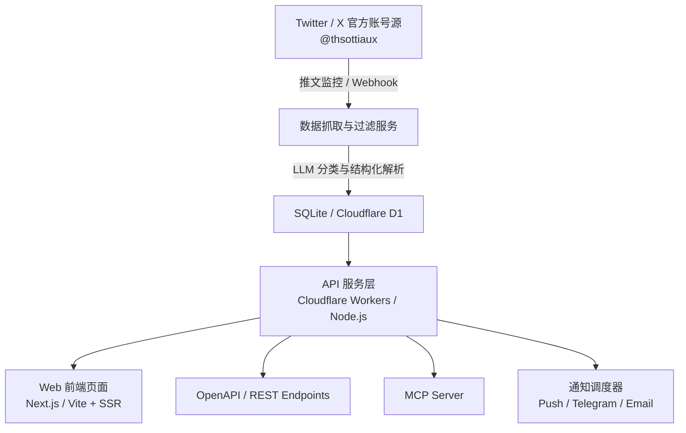

# Codex Resets Tracker

<div align="center">

**OpenAI Codex 额度重置监控与历史记录追踪器**  
*Track the latest OpenAI Codex limit resets, browse reset history, and get instant notifications.*

[](https://codex-resets.com/)
[](https://codex-resets.com/api/docs)
[](https://codex-resets.com/)
[](LICENSE)

[在线访问](https://codex-resets.com/) • [API 文档](https://codex-resets.com/api/docs) • [OpenAPI 规范](https://codex-resets.com/api/openapi.json) • [Telegram 订阅](https://t.me/codex_resets)

</div>

---

## 📖 项目简介 (Introduction)

**Codex Resets** 是一个专门针对 OpenAI Codex（GPT-5-Codex / Codex 编程模型）使用额度重置动态进行实时监控与历史追踪的项目。

当 OpenAI 官方（例如 [@thsottiaux](https://x.com/thsottiaux)）宣布重置全球或区域用户 Codex 限制时，该系统能够第一时间捕获、分析并向开发者推送通知，同时提供类似 GitHub 贡献图的热力图展示、重置周期统计分析以及开放的 REST API 与 MCP (Model Context Protocol) 接口。

参考线上站点：[https://codex-resets.com/](https://codex-resets.com/)

---

## ✨ 核心功能 (Key Features)

- ⏱ **实时重置状态看板 (Live Status)**
  - 显示最近一次 Codex 重置的具体时间、时间差（例如：`4 hours ago`）以及官方公告推文引用与原文。
  - 支持 Scheduled Reset（预告重置）与 Active Watch（AI 研判重置观察期）状态指示。

- 📊 **历史重置热力图 (Reset Heatmap)**
  - 类似 GitHub 贡献日历的交互式年历热力图，直观呈现过去 1 年每天的重置情况。
  - 支持普通重置（`regular`）、累积预存重置（`banked`）等多重类型分类展示，鼠标悬浮或点击可查看当次重置详情及推文链接。

- 📈 **数据统计指标 (Metrics & Stats)**
  - **总重置次数 (Total Resets)**：追踪历史至今累计重置次数。
  - **平均间隔时间 (Avg. Interval)**：计算两次重置之间的平均天数。
  - **最长等待时间 (Longest Wait)**：记录历史上等待重置的最长周期。

- 🔔 **多渠道提醒推送 (Multi-channel Notifications)**
  - **浏览器 Web Push**：桌面/移动浏览器一键开启原生推送提醒。
  - **Telegram 频道 / Bot**：即时接收 Telegram 消息推送 ([@codex_resets](https://t.me/codex_resets))。
  - **邮件订阅 (Email)**：重要重置确认即发邮件。

- 🔌 **开放 API & MCP 协议支持**
  - **RESTful API**：提供 `/api/v1/status` 和 `/api/v1/resets` 公开免费接口。
  - **MCP Server (Model Context Protocol)**：可无缝集成到 Claude Desktop、Cursor、Windsurf、Antigravity 等 AI IDE / Agent 环境，AI 助手可主动查询当前 Codex 额度是否已重置。

---

## 📡 开放 API 使用说明 (API Documentation)

Codex Resets 提供免鉴权、只读的公共 API，供开发者与工具直接集成。

基础 URL：`https://codex-resets.com`

### 1. 查询当前重置状态 (Get Status)

- **请求方式**：`GET /api/v1/status`
- **响应示例**：
```json
{
  "data": {
    "latest_reset": {
      "id": "2098685367058612394",
      "reset_type": "regular",
      "announced_at": "2026-09-12T08:09:17.000Z",
      "text": "Reset all propagated. Sweet dreams. https://t.co/VgKVUixoJG",
      "source": {
        "type": "x_post",
        "author": "thsottiaux",
        "url": "https://x.com/thsottiaux/status/2098685367058612394"
      }
    },
    "scheduled_reset": null,
    "active_watch": null,
    "stats": {
      "total": 53,
      "last_reset_at": "2026-09-12T08:09:17.000Z",
      "days_since_last": 0.2,
      "avg_interval_days": 6.9
    }
  },
  "meta": {
    "api_version": "v1",
    "generated_at": "2026-09-12T11:49:54.596Z"
  }
}
```

### 2. 获取历史重置公告列表 (List Resets)

- **请求方式**：`GET /api/v1/resets`
- **查询参数**：
  - `limit` (int, 默认 20, 最大 100): 返回条数
  - `cursor` (string): 分页游标
  - `from` (ISO 8601): 起始时间
  - `to` (ISO 8601): 截止时间
  - `order` (`asc` | `desc`, 默认 `desc`): 按时间升序或降序排序
- **响应示例**：
```json
{
  "data": [
    {
      "id": "2098685367058612394",
      "reset_type": "regular",
      "announced_at": "2026-09-12T08:09:17.000Z",
      "text": "Reset all propagated. Sweet dreams.",
      "source": {
        "type": "x_post",
        "author": "thsottiaux",
        "url": "https://x.com/thsottiaux/status/2098685367058612394"
      }
    }
  ],
  "pagination": {
    "has_more": false,
    "next_cursor": null
  },
  "meta": {
    "api_version": "v1",
    "generated_at": "2026-09-12T11:49:54.596Z"
  }
}
```

---

## 🤖 MCP (Model Context Protocol) 配置

可将 Codex Resets 作为 MCP 工具接入你的 AI 编程助手或 Agent。

在 `claude_desktop_config.json` 或 AI 工具的 MCP 配置中添加：

```json
{
  "mcpServers": {
    "codex-resets": {
      "url": "https://codex-resets.com/mcp",
      "type": "sse"
    }
  }
}
```

接入后，AI 即可拥有如下能力：
- `get_current_status`: 查询当前 Codex 额度重置状态、距上次重置时长与平均等待周期；
- `get_latest_reset`: 获取最新的额度重置公告详情及推文地址；
- `check_watch`: 检测当前是否有待生效的重置预告。

---

## 🏗 技术架构规划 (Architecture)



### 推荐技术栈
- **前端 (Frontend)**: React / Next.js / Vue 3 + Tailwind CSS + Lucide Icons
- **后端 (Backend & API)**: Cloudflare Workers / Hono / Node.js
- **数据源 & 调度 (Crawler & Worker)**: Twitter API v2 / RSSHub / 定时 Cron 任务
- **持久化存储 (Database)**: Cloudflare D1 / SQLite / PostgreSQL / Upstash Redis
- **推送服务 (Notifications)**: Web Push API (VAPID), Telegram Bot API, Resend

---

## 🚀 快速开始 (Quickstart)

### 环境要求
- Node.js >= 18.0.0
- npm / pnpm / yarn

### 步骤

1. **克隆代码库**
   ```bash
   git clone https://github.com/mhxy13867806343/fock-codex-resets.git
   cd fock-codex-resets
   ```

2. **后续开发计划**
   - [x] 初始化项目文档与规范 (`README.md`)
   - [ ] 搭建前端仪表盘 UI（Hero 状态区、热力图组件、统计卡片）
   - [ ] 接入 `/api/v1/status` 与 `/api/v1/resets` 数据代理与缓存
   - [ ] 实现 Telegram Bot 消息推送与 Web Push 订阅
   - [ ] 完善 MCP 协议适配器

---

## ⚖️ 免责声明 (Disclaimer)

- 本项目由社区开发者维护，非 OpenAI 官方项目。
- 重置信息来源于公开推文与社区观测，数据仅供开发者参考，重置以 OpenAI 官方实际生效为准。

---

## 📄 开源许可 (License)

[MIT License](LICENSE)
